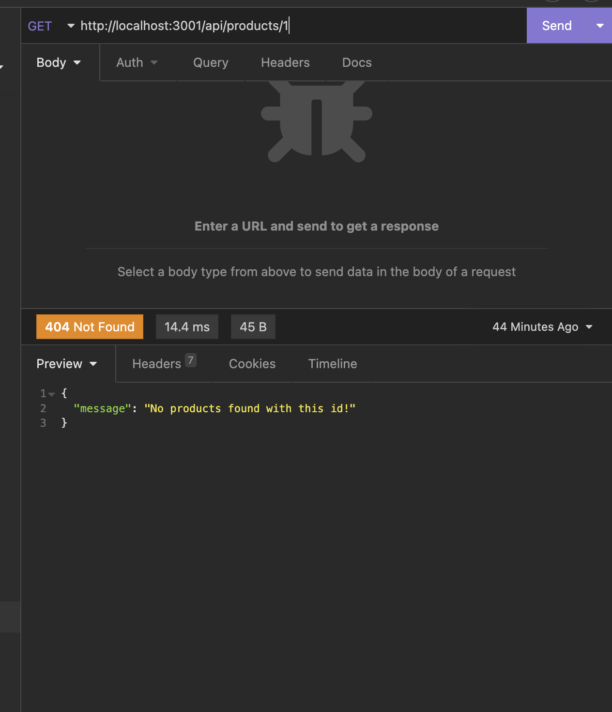
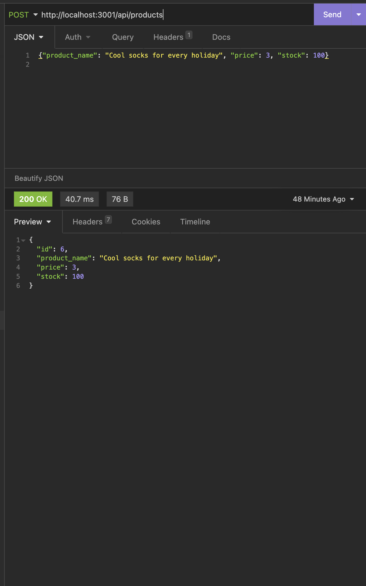

# *** E-COMMERCE-BACK-END ***

## **Description** 📚

*E-commerce-back-end * is the backend, using mysql and sequelize, for an e-commece site to be able to compete with other stores.

## **Table of Contents** 📄

* Installation
* Usage
* License
* Contributing
* Testing
* Technology
* Questions

---

## **Installation** ⚙️

To use this application clone down the repository: [GitHub Repository](https://github.com/scarfrae/E-commerce-Back-End). 

Then install these dependencies in your root (npm install):
* mysql2
* dotenv
* sequelize
* express

To run application:
* run mysql shell: mysql -u root -p
* run seeds: npm run seeds
* start server: npm run start
* look on insomnia etc. to check backend 

### **Usage** 💻
* NOTE: 200 is success message and 404 is error message 
* Users can get catagory or product or tag by id 

* Users can get all of catagory or product or tag

* Users can update catagory or product or tag

* Users can create catagory or product or tag

* Users can delete catagory or product or tag 

To view video walkthrough visit:
https://watch.screencastify.com/v/FCH4r6KWFZJYIkJxf5zk

### **License** 💳

MIT License

Copyright © 2022

Permission is hereby granted, free of charge, to any person obtaining a copy of this software and associated documentation files (the "Software"), to deal in the Software without restriction, including without limitation the rights to use, copy, modify, merge, publish, distribute, sublicense, and/or sell copies of the Software, and to permit persons to whom the Software is furnished to do so, subject to the following conditions:

The above copyright notice and this permission notice shall be included in all copies or substantial portions of the Software.

THE SOFTWARE IS PROVIDED "AS IS", WITHOUT WARRANTY OF ANY KIND, EXPRESS OR IMPLIED, INCLUDING BUT NOT LIMITED TO THE WARRANTIES OF MERCHANTABILITY, FITNESS FOR A PARTICULAR PURPOSE AND NONINFRINGEMENT. IN NO EVENT SHALL THE AUTHORS OR COPYRIGHT HOLDERS BE LIABLE FOR ANY CLAIM, DAMAGES OR OTHER LIABILITY, WHETHER IN AN ACTION OF CONTRACT, TORT OR OTHERWISE, ARISING FROM, OUT OF OR IN CONNECTION WITH THE SOFTWARE OR THE USE OR OTHER DEALINGS IN THE SOFTWARE.

### **Testing** 📝
All testing was done by the developing team.

### **Technology** 💡
* Node.js
* Sequelize
* MySql2
* Express
* Dotenv
* Screencastify

### **Contact** ☎
* Sterling Cafrae **-** [Github](https://github.com/scarfrae)**,** [LinkedIn](https://www.linkedin.com/in/sterling-carfrae-a2a8151a5/)
...
***

